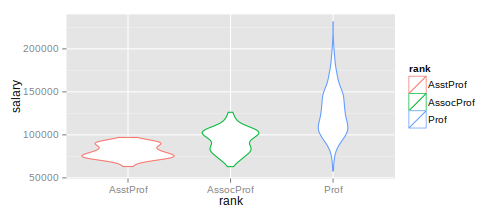

## Intro

Have you ever wondered what it would be like...

* to show your model interactively?
* to answer what-if questions on-the-fly?
* to have more graphs, tables, text visible next to each other?
* to deploy your work via a simple link?

Then you should definitely try shiny.

--- .class #id 

## Technology in a nutshell

1. Create your analysis in R as you would do normally.
2. Organize it into a server side logic (responsible for calculations), and client side logic (responsible for display organization)
3. Make use of the available input controls and the responding output elements.
4. Publish it to rpubs or github.
5. Send the link to your users.

---

## My example

I have created a simple shiny app that lets you discover the interactivity possibilities in shiny. 

The used database is the salaries dataset by Vincent Arel-Bundock. It is available in the 'car' package.


A glimpse into the dataset:

```r
dim(Salaries)
```

```
## [1] 397   6
```

```r
head(Salaries, n = 2)
```

```
##   rank discipline yrs.since.phd yrs.service  sex salary
## 1 Prof          B            19          18 Male 139750
## 2 Prof          B            20          16 Male 173200
```

---

## Analysis

I have provided the app with two pages for analysis: a univariate and a multivariate tab.

Univariate tab: it displays a simple historgram in case of numerical variables and a violin plot for chategorical (factor) variables. The latter is not "truly univariate" but I thought it means more to show the relation to the dependent variable than to display only a few summary numbers.

Multivariate tab: it displays a pairs plot, known as scatterplot for all the variables. Use this to observe the connection between variables.

Both tabs change their content based on input conrols!

---

## Example: univariate tab

The following would be shown if you were to choose rank in the dropdown list.

 

The background code:
```
q <- ggplot(data = Salaries)
q <- q + geom_violin(aes(x = rank, y = salary, color = rank))
print(q)
```

---

## The model

---

## So...

1. The link:
2. Any questions?
3. Discover it for yourself! :)
